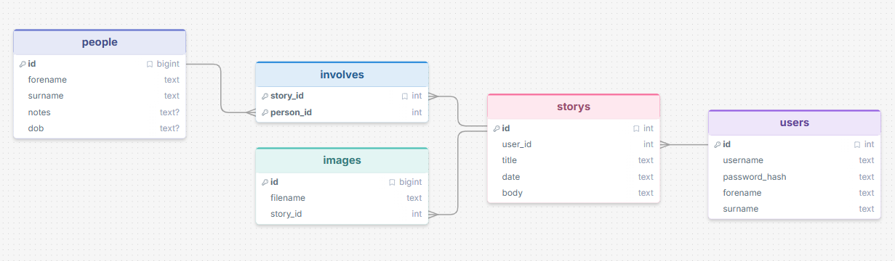
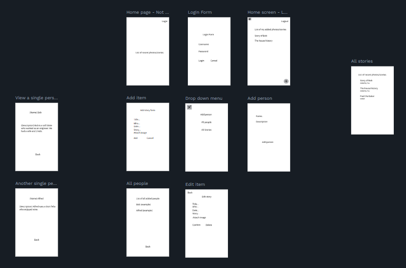
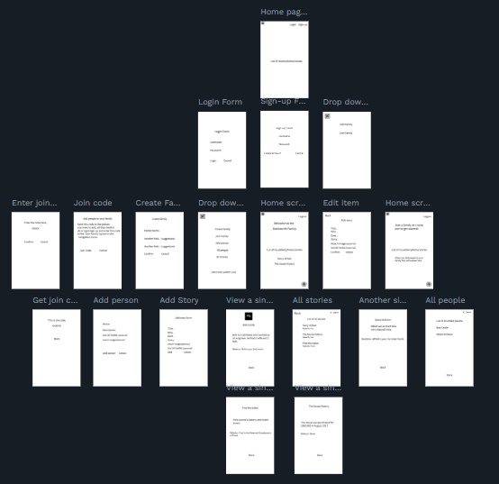

# Sprint 1 - Developing a DB and UI Prototype

## Sprint Goals

Develop a design for the database and a UI prototype that simulates the key functionality of the system. Test and refine the UI so that it can serve as the model for the next phase of development in Sprint 2.

### Specific Goals

**Edit these goals as needed**

- Design the database:
    - Tables
    - Fields / types
    - Primary keys
    - Default / nullable values
    - Relationships (foreign keys)
- Design the UI
    - Key pages
    - User interactions and 'flow'
    - Page layouts / features
    - Colour palette
    - Etc.

## Initial Database Design

Replace this text with notes regarding the DB design.

### Required Data Input

Replace this text with a description of what data will be input, and where / how it will be obtained.

### Required Data Output

Replace this text with a description of the outputs for the system - what types of data will be displayed?

### Required Data Processing

Replace this text with a description of how the data will be processed to achieve the desired output(s) - any processes / formulae?

## UI 'Flow'

The first stage of prototyping was to explore how the UI might 'flow' between states, based on the required functionality.

This Figma demo shows the initial design for the UI 'flow':

[Click here to see the design](https://design.penpot.app/#/view?file-id=f0485fb1-4e63-8165-8008-39076505d61a&page-id=f0485fb1-4e63-8165-8008-39076505d61b&section=inspect&frame-id=4cb224c8-461b-806e-8008-39077882bd5e&index=0&share-id=f0485fb1-4e63-8165-8008-39207f8ccf2c)

### Testing

I loaded my prototype version and went to every page to check if they were connected. When I was satisfied with this I gave it to my stakeholder to give me feedback. 
he said (condensed version) "It looks like a good frame work but maybe you could add a link to a persons social media? You could also have their relation to you" 

### Changes / Improvements

Based on this feedback I added the suggestions. These were the social media link option and a profile photo for the person. 

## Initial UI Prototype

The next stage of prototyping was to develop the layout for each screen of the UI.

This Figma demo shows the initial layout design for the UI:

[Click here to see the design](https://design.penpot.app/#/view?file-id=6956fb43-d0b4-807f-8008-420975b4a165&page-id=f0485fb1-4e63-8165-8008-39076505d61b&section=interactions&frame-id=4cb224c8-461b-806e-8008-39077882bd5e&index=0&share-id=83dd9eca-2062-81d6-8008-5a72ff5e916e)

### Testing

This was a similar process to the flow design where i checked everything worked then handed it to my end-user.

### Changes / Improvements

Replace this text with notes any improvements you made as a result of the testing.

*FIGMA IMPROVED PROTOTYPE - PLACE THE FIGMA EMBED CODE HERE - MAKE SURE IT IS SET SO THAT EVERYONE CAN ACCESS IT*

## Refined UI Prototype

Having established the layout of the UI screens, the prototype was refined visually, in terms of colour, fonts, etc.

This Figma demo shows the UI with refinements applied:

*FIGMA REFINED PROTOTYPE - PLACE THE FIGMA EMBED CODE HERE - MAKE SURE IT IS SET SO THAT EVERYONE CAN ACCESS IT*

### Testing

Replace this text with notes about what you did to test the UI flow and the outcome of the testing.

### Changes / Improvements

Replace this text with notes any improvements you made as a result of the testing.

*FIGMA IMPROVED REFINED PROTOTYPE - PLACE THE FIGMA EMBED CODE HERE - MAKE SURE IT IS SET SO THAT EVERYONE CAN ACCESS IT*

## Sprint Review

Replace this text with a statement about how the sprint has moved the project forward - key success point, any things that didn't go so well, etc.

